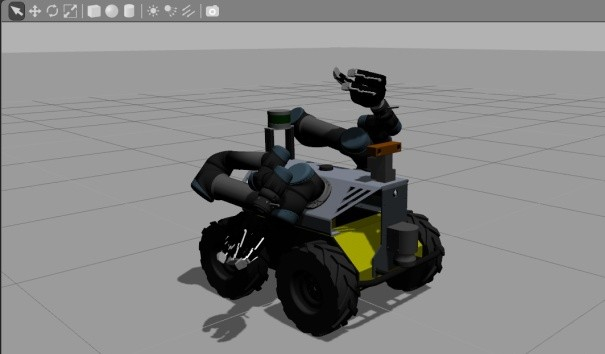
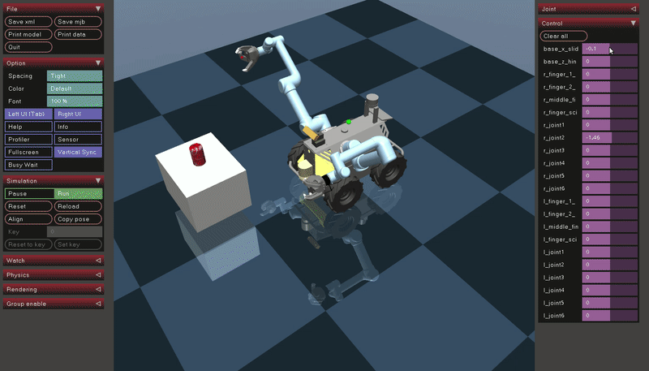

# Dual-UR5-Husky-MuJoCo model


> Your robot may have different components, such as arm, gripper, force sensor. So please check it carefully if you want to this model!

We will create a dual ur5 husky mujoco model based on original dual-ur5-husky reps. For the Gazebo demo and some related setting, you can find [old repo](https://github.com/DualUR5Husky/husky) and [new repo](https://github.com/husky/husky_manipulation/blob/kinetic-devel/husky_ur_description/urdf/husky_dual_ur5_description.urdf.xacro). We use old repo in this tutorial.

Here is the official introduction about URDF in mujoco [here](http://www.mujoco.org/book/modeling.html#CURDF), we can know that urdf is different from mujoco mjcf file.

## Step1: get ROS packages
What we need for the mojuco model is just the stl file and urdf file. So first, download all the needed packages as follows:
```bash
mkdir -p ~/dual_ws/src
cd ~/dual_ws/src && catkin_init_workspace
git clone https://github.com/DualUR5Husky/husky
git clone https://github.com/DualUR5Husky/ur_modern_driver
git clone https://github.com/DualUR5Husky/universal_robot
git clone https://github.com/DualUR5Husky/robotiq
git clone https://github.com/DualUR5Husky/husky_simulator
git clone https://github.com/DualUr5Husky/flir_ptu
```
Some official repos have updated, like [universal_robot](https://github.com/ros-industrial/universal_robot), [robotiq](https://github.com/ros-industrial/robotiq). If you want to control them for the real robot, please update the latest drivers. But for now, we just use the husky repos for modelling.

The dual ur5 husky model in Gazebo: 

.

There are some points you need to notice for mujoco modelling.

## Step2: verify mesh file

For the URDF file, there usually have two types of mesh file: dae file for visualization and stl file for collision. However, from [here](http://www.mujoco.org/forum/index.php?threads/unknown-mesh-file-type-dae.3495/), we can know that mujoco cannot import `.dae` file, so we should convert the `.dae` file to `.stl` file. You can use [MeshLab](http://www.meshlab.net/) to convert the format and it is very easy to use. 

Then, we should put all the mesh files to a folder that mujoco can find them. P.S. some related questions here: [Multiple mesh folders](http://www.mujoco.org/forum/index.php?threads/multiple-mesh-folders.3720/) 

Here, I create a folder named [meshes-mujoco](./husky_description/meshes_mujoco/flir-ptu-simple.stl) and put all the related mesh files in it (each mesh file must has unique name).

## Step3: verify URDF file

**1. add mujoco tags**

From the top robot urdf tags, we need to add some mujoco tags. For my robot, the **meshdir**, **balanceinertia**, **discardvisual** tags are needed. For the details of the tags, [click here](http://www.mujoco.org/book/XMLreference.html#compiler).

Add **balanceinertia** tag if you get the error:
```bash
Error: inertia must satisfy A + B >= C; use 'balanceinertia' to fix
Object name = inertial_link, id = 3
```

If you want your robot look good, not just simple geometry, add **discardvisual** tag. The default value is true, so it will discard the visual stl file and change the complex mesh files to the simple convexhull geometry files, like box, cylinder. The reason is that the pysical simulator can only use the simple geometry to calculate or detect collision. See more details [here (some meshes ignored when converting urdf to mjcf)](http://www.mujoco.org/forum/index.php?threads/meshes-ignored-when-converting-urdf-to-mjcf.3433/).

Note that the collision geoms are placed in geom group 0 in default, while visual geoms are placed in geom group 1. You can toggle the rendering of each group **pressing '0' and '1'** respectively (in the GUI, press "0" and "1", you can see the collision rendering(simple geometry) or visual rendering(beautiful)). 

```xml
  <mujoco>
        <compiler 
        meshdir="../meshes_mujoco/" 
        balanceinertia="true" 
        discardvisual="false" />
  </mujoco>
```

**2. check urdf file**

What's more, do not forget to change the path of mesh file that they can find the files.

If you have the xacro file, you need to convert it to a urdf file first:

```bash
rosrun xacro xacro --inorder model.xacro > model.urdf
```

Then use ROS command to check the urdf file. If there are errors, check your xacro file again.

```bash
check_urdf model.urdf
````
**3. visualize the model in rviz (not a must)**

```bash
roslaunch urdf_tutorial display.launch model:=path/to/your/urdf/file
```

## Step4: convert urdf file to mjcf file

**1. convert**
Enter the path `~/mujoco/mujoco200/bin` first and run command below:

```bash
$./compile /path/to/model.urdf /path/to/model.xml
```

Helper function:
```bash
$./compile
 Usage: compile infile outfile
  infile can be in mjcf, urdf, mjb format
  outfile can be in mjcf, mjb, txt format
```
Usually, we use the xml file.

**2. test**

```bash
mujoco200/bin$ ./simulate /path/to/model.xml
```
Here is the visual version:


Here is the collision version:


Here is the video:


## Step5: add more mujoco tags

The raw xml file only contain basic robot structures, so we must add more mujoco tags. From [here](https://github.com/openai/mujoco-py/issues/216) get more details.

Add light and some other objects:


The final model is [here](./dual_ur5_husky/mobile_pick_and_place.xml):



## What's the next

Okay we have got a initial mujoco model. However, if you want to use the model in reinforcement learning or control loop, there are still a lot of works to do. Here are good repos to refer:
- [official mujoco document](http://www.mujoco.org/book/index.html)
- [mujoco_py](https://github.com/openai/mujoco-py)
- [OpenAI Gym mujoco envs](https://github.com/openai/gym/tree/master/gym/envs)
- [Standford robosuite](https://github.com/StanfordVL/robosuite)
- [Vikash Kumar](https://github.com/vikashplus?tab=repositories)

## License

dual_ur5_husky_mujoco is open-sourced under the Apache-2.0 license. See the
[LICENSE](./LICENSE) file for details.

## Citation
 Please cite the paper in your publications if it helps your research:

 ```BibTeX
@Article{s20030939,
AUTHOR = {Wang, Cong and Zhang, Qifeng and Tian, Qiyan and Li, Shuo and Wang, Xiaohui and Lane, David and Petillot, Yvan and Wang, Sen},
TITLE = {Learning Mobile Manipulation through Deep Reinforcement Learning},
JOURNAL = {Sensors},
VOLUME = {20},
YEAR = {2020},
NUMBER = {3},
ARTICLE-NUMBER = {939},
URL = {https://www.mdpi.com/1424-8220/20/3/939},
ISSN = {1424-8220},
DOI = {10.3390/s20030939}
}
 ```
