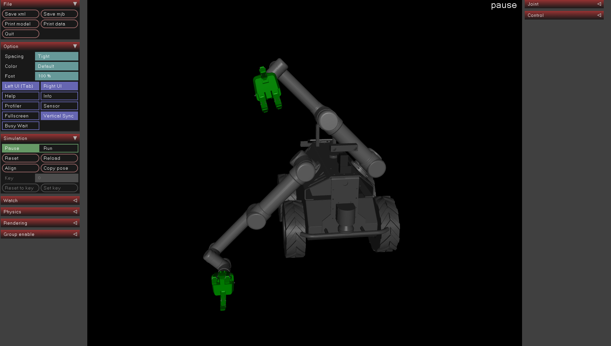
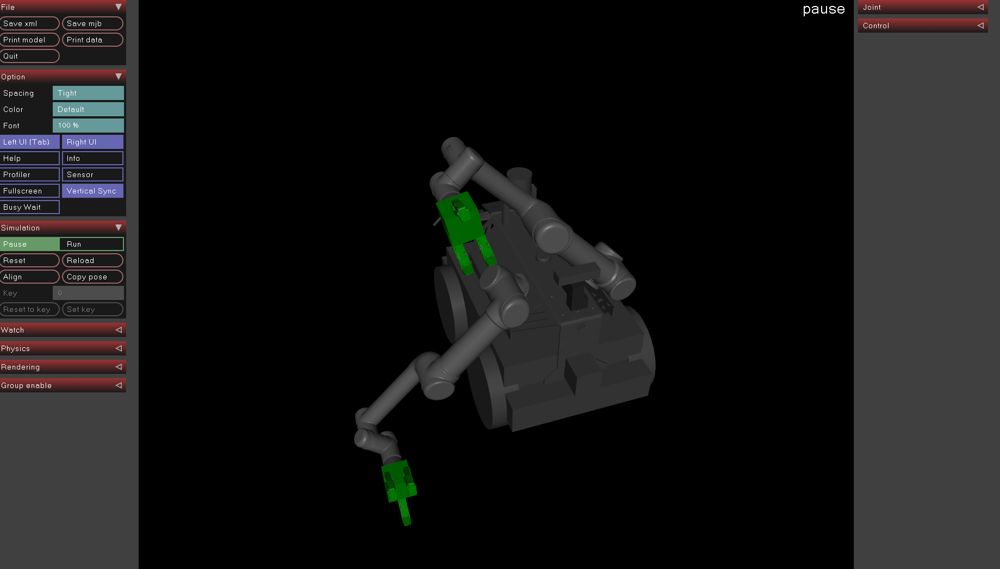
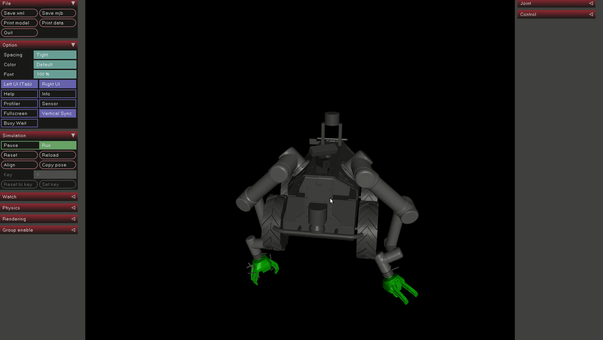
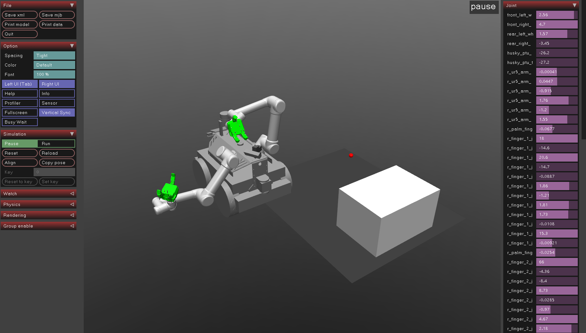

# Dual-UR5-Husky-MuJoCo model

We will create a dual ur5 husky mujoco model based on original dual-ur5-husky reps. For the Gazebo demo and some related setting, you can find [here](http://www.clearpathrobotics.com/assets/guides/husky/HuskyDualManip.html).

What we need for the mojuco model is just the stl file and urdf file. So first, download all the needed packages as follows:
```bash
mkdir -p ~/dual_ws/src
cd ~/dual_ws/src && catkin_init_workspace
git clone https://github.com/DualUR5Husky/husky
git clone https://github.com/DualUR5Husky/ur_modern_driver
git clone https://github.com/DualUR5Husky/universal_robot
git clone https://github.com/DualUR5Husky/robotiq
git clone https://github.com/DualUR5Husky/husky_simulator
git clone https://github.com/DualUr5Husky/flir_ptu
```
Some official reps may update, like [universal_robot](https://github.com/ros-industrial/universal_robot), [robotiq](https://github.com/ros-industrial/robotiq). If you want to control them for the real robot, please update the latest drivers. But for now, we just use the husky reps for modelling.

For the Gazebo simulation: .

There are some points you need to notice for mujoco modelling.

1. prepare the ingredient for urdf file.

From [here](), we can know that urdf is different from mujoco mjcf file. So first, we should do some pre-processing.

- mesh file

For the URDF file, there usually have two mesh files: dae file for visualization and stl file for collision. However, from [here](http://www.mujoco.org/forum/index.php?threads/unknown-mesh-file-type-dae.3495/), we can know that mujoco cannot import .dae file, so we should convert the .dae file to .stl file. You can use [MeshLab](http://www.meshlab.net/) to convert and it is very easy to use. But if you have a lot of mesh file to convert, ...

Then, we should put all the mesh files to a folder that mujoco can find them. P.S. some related questions here: [Multiple mesh folders](http://www.mujoco.org/forum/index.php?threads/multiple-mesh-folders.3720/) 

Here, I create a folder named [meshes-mujoco]() and put all the related mesh files in it (every mesh file has uniq name).

- change the urdf/xacro file

change every .dae file to .stl file, using the new mesh file converted from MeshLab.

- add some mujoco tags into the urdf file

From the top robot urdf tags, we need to add some mujoco tags. For my robot, the **meshdir**, **balanceinertia**, **discardvisual** tags are needed. For the details of the tags, [click here](http://www.mujoco.org/book/XMLreference.html#compiler).

Add **balanceinertia** tag if you get the error:
```bash
Error: inertia must satisfy A + B >= C; use 'balanceinertia' to fix
Object name = inertial_link, id = 3
```

If you want your robot look good, not just simple geometry, add **discardvisual** tag. The tag default is true, so it discard the visual stl file and change some complex mesh file to the simple convexhull geometry, like box, cylinder. Because for the pysical simulator, it just use the simple geometry to calculate or collision detection. ROS also has the charactor, using FCL for collision detection.

From [here (some meshes ignored when converting urdf to mjcf)](http://www.mujoco.org/forum/index.php?threads/meshes-ignored-when-converting-urdf-to-mjcf.3433/):

`
Darwin has collision meshes, which is why they are showing. *Sawyer only has visual meshes, which are discarded automatically when discardvisual="true", which is the default when parsing URDFs. So you need to set **discardvisual="false"** in \<compiler> tag*. Also, you have a box with size="0 0 0" which is an error. Geom sizes must be positive. See attached model.

Note that collision geoms are placed in geom group 0, while visual geoms are placed in geom group 1. You can toggle the rendering of each group **pressing '0' and '1'** respectively (in the GUI, press "0" and "1", you can see the collision rendering(simple geometry) or visual rendering(beautiful)). 
`

```xml
  <mujoco>
        <compiler 
        meshdir="../meshes_mujoco/" 
        balanceinertia="true" 
        discardvisual="false" />
  </mujoco>
```

- check urdf file

If you have the xacro file, you need to convert it to the urdf file:
```bash
rosrun xacro xacro --inorder model.xacro > model.urdf
```
Then use this to check the urdf file. If there are errors, check you xacro file again.
```bash
check_urdf model.urdf
````
You can also get the kinetic tree to look the detals.

Visualize the urdf file in RViz.
```bash
roslaunch urdf_tutorial display.launch model:=path/to/your/urdf/file
```


- convert urdf to mjcf file

In the path ~/mujoco/mujoco200/bin, you can run command below:
```bash
$./compile /path/to/model.urdf /path/to/model.mjb
$./compile /path/to/model.urdf /path/to/model.txt
$./compile /path/to/model.urdf /path/to/model.xml
```
Helper function:
```bash
$./compile
 Usage: compile infile outfile
  infile can be in mjcf, urdf, mjb format
  outfile can be in mjcf, mjb, txt format
```
Usually, we use the xml file.

- change the raw xml file to adapt the mujoco

[Here](https://github.com/openai/mujoco-py/issues/216) introduces some related thing to change.


- test your mujoco model file

```bash
mujoco200/bin$ ./simulate /path/to/model.xml
```   

Here is the visual version:


Here is the collision version:


Here is the video:


Add light and some other objects:
   
